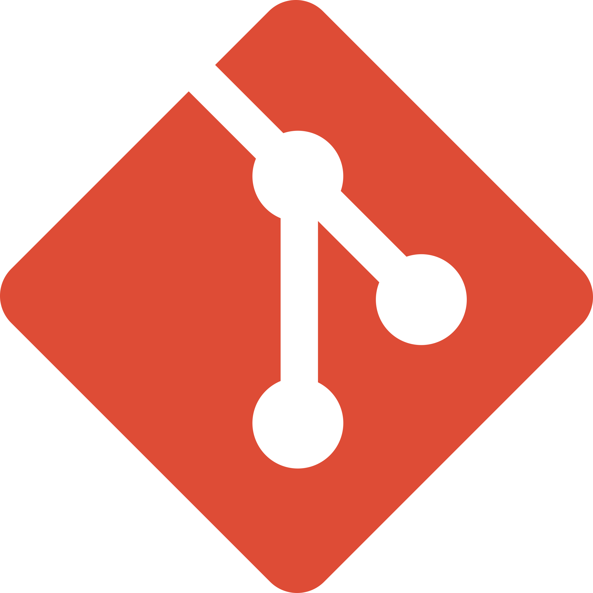
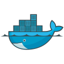

<!--NAME part -->

 
 
 

Hello world ✋ I love building something that changes lives in better way 🏗️ 
I do DIY projects, board games, and play with Coco🐾 in my free time 

 
 

<h3 align="center">Tech Stack</h3>
<!-----Techstack--->

 &nbsp;
 &nbsp;
 &nbsp;
 &nbsp;
 &nbsp;
 &nbsp;
 &nbsp;
 &nbsp;
 &nbsp;

<!---- stack part-->

        
&nbsp; &nbsp; &nbsp; 
     

 

<!----footer-->

<!--
**developer-jiheui/developer-jiheui** is a ✨ _special_ ✨ repository because its `README.md` (this file) appears on your GitHub profile.

Here are some ideas to get you started:

- 🔭 I’m currently working on ...
- 🌱 I’m currently learning ...
- 👯 I’m looking to collaborate on ...
- 🤔 I’m looking for help with ...
- 💬 Ask me about ...
- 📫 How to reach me: ...
- 😄 Pronouns: ...
- ⚡ Fun fact: ...
-->
